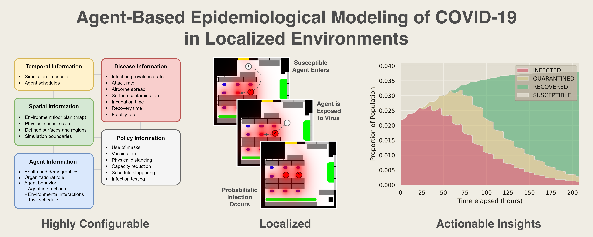

# Localized Epidemiological Agent-Based Simulation (LocABS)

[](https://doi.org/10.1016/j.compbiomed.2022.105396)
[](https://www.python.org/downloads/)
[](https://github.com/PCiunkiewicz/loc-abs/actions/workflows/ruff.yml)
[](https://opensource.org/licenses/MIT)



**[1] “Agent-based epidemiological modeling of COVID-19 in localized environments,”**

*P. Ciunkiewicz, W. Brooke, M. Rogers, and S. Yanushkevich,*

Computers in Biology and Medicine, vol. 144, p. 105396, May 2022, doi: [10.1016/j.compbiomed.2022.105396](https://doi.org/10.1016/j.compbiomed.2022.105396).

> Epidemiological modeling is used, under certain assumptions, to represent the spread of a disease within a population. Information generated by these models can then be applied to inform public health practices and mitigate risk. To provide useful and actionable preparedness information to administrators and policy makers, epidemiological models must be formulated to model highly localized environments such as office buildings, campuses, or long-term care facilities. In this paper, a highly configurable agent-based simulation (ABS) framework designed for localized environments is proposed. This ABS provides information about risk and the effects of both pharmacological and non-pharmacological interventions, as well as detailed control over the rapidly evolving epidemiological characteristics of COVID-19. Simulation results can inform decisions made by facility administrators and be used as inputs for a complementary decision support system. The application of our ABS to our research lab environment as a proof of concept demonstrates the configurability and insights achievable with this form of modeling, with future work focused on extensibility and integration with decision support.

**[2] “Decision Support Component for the Localized Epidemiological Modelling of COVID-19,”**

*P. Ciunkiewicz and S. Yanushkevich,*

2023 IEEE Symposium Series on Computational Intelligence (SSCI), Dec. 2023, pp. 759–764. doi: [10.1109/SSCI52147.2023.10371839](https://doi.org/10.1109/SSCI52147.2023.10371839).

> This study develops a decision support system for localized epidemiological modelling of infectious disease spread. We propose a Bayesian network topology for performing inference supplementary to an epidemiological simulation framework and a cohesive integration of this decision support system with the framework. The Bayesian network topology is structured with data defined as inputs, outputs, or derived features within the simulation framework. All features are mo-tivated by their clinical relevance and utility for administrative policy guidance. Edges in the final network are quantitatively assessed using structural equation modelling to ensure strong causal connections. Various inference scenarios are demon-strated to provide proof of concept for real-world application and validation in future directions. The outcomes of this project contribute to a larger body of work for infectious disease risk mitigation and emergency management in generalized environments.


## Agent-Based Model Simulation notes

### Docker Compose

This tool uses docker to orchestrate the various services required to run the simulation. Launch the stack using

```bash
docker compose up
```

OR (for older versions of docker compose)

```bash
docker-compose up
```


### Simulation Components


### Script Entrypoints

Note that these script invocations should be done from the `backend/` directory.

#### Launch

```bash
python launch.py
```

The CLI tool will guide you through selecting the config file, launch method, number of runs, etc.

#### Export

```bash
python export.py
```

The CLI tool (in-progress) will guide you through selecting a simulation output file / directory, export type (animation, snapshot, statistics, etc.), export save location, etc.
